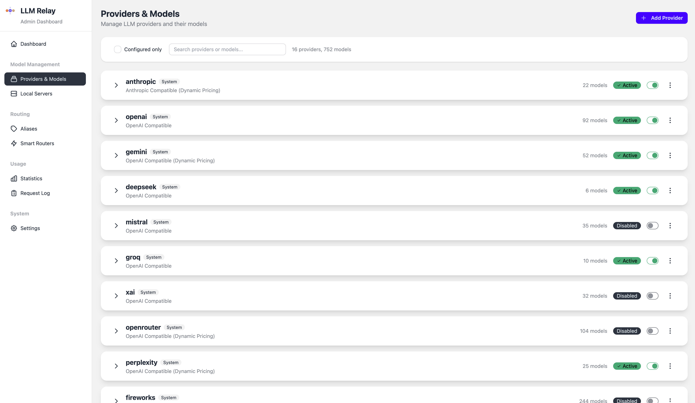

<p align="center">
  
</p>

<h1 align="center">LLM Relay</h1>

<p align="center">
<strong>A lightweight, self-hosted LLM Proxy and Smart Router</strong><br>
Unified API for cloud and local LLMs with cost tracking, attribution and smart routing.
</p>

<p align="center">
  
</p>

---

## What is LLM Relay?

A single self-hosted proxy that puts all your LLM providers behind one API:

- **One endpoint, all models** — Claude, GPT, Gemini, Llama, and 700+ others
- **Accurate cost tracking** — Token-level tracking with cache and reasoning tokens
- **Flexible attribution** — Tag requests by user, project, or team
- **Works with any client** — Ollama and OpenAI API compatible
- **Smart routing** — Route requests to the best model for the job

## Quick Start

```bash
git clone https://github.com/benhumphry/llm-relay.git
cd llm-relay
cp .env.example .env
# Add your API keys to .env

docker compose up -d
```

**That's it.** Your proxy is running:
- API: http://localhost:11434
- Admin UI: http://localhost:8080

## Use It

```python
from openai import OpenAI

client = OpenAI(base_url="http://localhost:11434/v1", api_key="my-team")

# Use any provider through one client
client.chat.completions.create(model="claude-sonnet", messages=[...])
client.chat.completions.create(model="gpt-4o", messages=[...])
client.chat.completions.create(model="gemini-2.5-pro", messages=[...])
```

Or with curl:

```bash
curl http://localhost:11434/api/chat \
  -d '{"model": "claude-sonnet", "messages": [{"role": "user", "content": "Hello!"}]}'
```

Works with Open WebUI, Cursor, Continue, and any Ollama or OpenAI-compatible client.

## Features

### Providers

15 built-in providers, 700+ models:

| Provider | Set Environment Variable |
|----------|--------------------------|
| Anthropic | `ANTHROPIC_API_KEY` |
| OpenAI | `OPENAI_API_KEY` |
| Google Gemini | `GOOGLE_API_KEY` |
| DeepSeek | `DEEPSEEK_API_KEY` |
| Mistral | `MISTRAL_API_KEY` |
| Groq | `GROQ_API_KEY` |
| xAI | `XAI_API_KEY` |
| Perplexity | `PERPLEXITY_API_KEY` |
| OpenRouter | `OPENROUTER_API_KEY` |
| Fireworks | `FIREWORKS_API_KEY` |
| Together AI | `TOGETHER_API_KEY` |
| DeepInfra | `DEEPINFRA_API_KEY` |
| Cerebras | `CEREBRAS_API_KEY` |
| SambaNova | `SAMBANOVA_API_KEY` |
| Cohere | `COHERE_API_KEY` |

Plus: connect local Ollama instances and add custom OpenAI-compatible providers through the Admin UI.

<p align="center">
  
</p>

### Cost Tracking

Every request is logged with input tokens, output tokens, reasoning tokens, cache tokens, and calculated cost. View breakdowns by provider, model, tag, or client in the Admin UI.

Pricing syncs from LiteLLM and handles provider quirks automatically (Gemini tiered pricing, Perplexity per-request fees, Anthropic cache multipliers, etc).

### Tagging

Attribute costs to users, projects, or teams:

```bash
# Via bearer token
curl -H "Authorization: Bearer alice,project-x" ...

# Via header  
curl -H "X-Proxy-Tag: alice,project-x" ...

# Via model suffix
curl -d '{"model": "claude-sonnet@alice"}' ...
```

### Aliases

Create friendly names for models:

| Alias | Target |
|-------|--------|
| `claude` | `anthropic/claude-sonnet-4-20250514` |
| `gpt` | `openai/gpt-4o` |
| `fast` | `groq/llama-3.3-70b-versatile` |

### Smart Routers

Let an LLM pick the best model for each request. Configure candidate models, and a fast designator model routes requests based on query content.

<p align="center">
  
</p>

### Admin UI

Clean web interface for:
- Provider and model management
- Ollama instance management (pull/delete models)
- Usage analytics with charts and filters
- Settings, pricing sync, data export

## Installation

### Docker Compose

```yaml
services:
  llm-relay:
    image: ghcr.io/benhumphry/llm-relay:latest
    ports:
      - "11434:11434"
      - "8080:8080"
    volumes:
      - llm-relay-data:/data
    env_file:
      - .env

volumes:
  llm-relay-data:
```

### Environment Variables

| Variable | Default | Description |
|----------|---------|-------------|
| `PORT` | 11434 | API server port |
| `ADMIN_PORT` | 8080 | Admin UI port |
| `ADMIN_PASSWORD` | (random) | Admin UI password |
| `DATABASE_URL` | SQLite | PostgreSQL URL for production |

API keys support Docker secrets via `_FILE` suffix:
```yaml
environment:
  - ANTHROPIC_API_KEY_FILE=/run/secrets/anthropic_key
```

### Without Docker

```bash
python -m venv venv && source venv/bin/activate
pip install -r requirements.txt
python proxy.py
```

## API Endpoints

### Ollama API
- `GET /api/tags` — List models
- `POST /api/chat` — Chat completion
- `POST /api/generate` — Text generation

### OpenAI API
- `GET /v1/models` — List models
- `POST /v1/chat/completions` — Chat completion

## License

MIT
